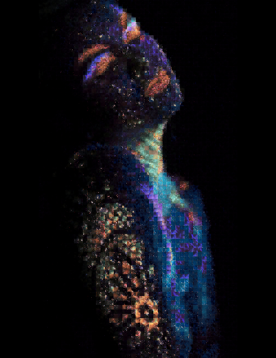

# Art created with artificial intelligence
A deep convolutional generative adversarial network (DCGAN) is trained on pictures of art. Fictional machine hallucations are created from the generative neural network by sampling the latent space. Information on the neural network architecture can be found here: https://arxiv.org/abs/1511.06434


Use the procedurally generated tiles to create mosaics



A high res version on Reddit can be found [here](https://www.reddit.com/r/Art/comments/evop8p/galaxy_girl_me_digital_2020/)


## Dependencies
- [Python 3+](https://www.anaconda.com/distribution/)
- Keras, Tensorflow, Matplotlib, Numpy, PIL, Scikit-learn

## Creating an animated mosaic 
Load a pretrained model into `animated_mosaic.py` and then run the script. Creating a video will take about 10-30 minutes depending on the length because each frame is rendered individually. The images from the neural network will be saved to a directory called `images/`. Afterwards, a video can be created by stitching the images into a `gif` or `mp4` with `ffmpeg`. For example: 

`ffmpeg -framerate 30 -i "fluidart_%05d.png" -c:v libx264 -pix_fmt yuv420p fluidart.mp4` 


## Pre-trained Models
I have included two pretrained models for people to play with

`generator (space_128_128).h5` will create images like the one below. The images are generated from a latent parameter space of 128 dimensions and the output images will be 128 x 128. This network was trained on images of galaxies from the [NASA image archive](https://images.nasa.gov/). 


`generator (fluid_256_128).h5` is a 256 dimensional model that outputs a 128 x 128 image. The algorithm was trained on pictures of fluid art. 


## Train your own model
1. Download your favorite images to a new directory
2. Change some parameters below like: `directory`, `name`, `latent_dim`, `epochs`, etc..
3. Run the code

```python 
from dcgan import DCGAN, create_dataset

if __name__ == '__main__':

    x_train, y_train = create_dataset(128,128, nSlices=150, resize=0.75, directory='space/')
    assert(x_train.shape[0]>0)

    x_train /= 255 

    dcgan = DCGAN(img_rows = x_train[0].shape[0],
                    img_cols = x_train[0].shape[1],
                    channels = x_train[0].shape[2], 
                    latent_dim=32,
                    name='nebula_32_128')
                    
    dcgan.train(x_train, epochs=10000, batch_size=32, save_interval=100)
```
The neural network will create outputs during the training process to the folder: `images/`. This process could take a while depending on your computer. For comparison the two pretrained models used 15000 training epochs which took ~1-2 hours on a GTX 1070. 

## Creating a custom data set
The  `create_dataset` function will cut random slices from images to create a new data set. This function requires you to put images in a new directory before hand
```python
import matplotlib.pyplot as plt
import numpy as np

from dcgan import create_dataset 

# first resize the original image to 75% 
# then cut 100 random 128x128 subframes from each image in the directory 
x_train, y_train = create_dataset(128,128, nSlices=100, resize=0.75, directory='space/')

# scale RGB data between 0 and 1
x_train /= 255 

# plot results to make sure data looks good!
fig, axs = plt.subplots(4, 4)
for i in range(4):
    for j in range(4):
        axs[i,j].imshow( x_train[ np.random.randint(x_train.shape[0]) ] )
        axs[i,j].axis('off')
plt.show()
```
An example output should look like this: 


If `x_train` is empty make sure you have `.jpg` or `.png` files in the directory where your images are stored (e.g. `space/`) 

## Ways to improve images
If your images are looking bad, try to increase the number of dimensions in your latent space. Sometimes adding more dropout into the layers of the generative model can help too. This was often my go to when the discriminator had an accuracy of 100% which hindered the generator from learning. 

If you can think of a way to improve the image resolution and still have it train in a sensible time with 1 GPU, let me know!
